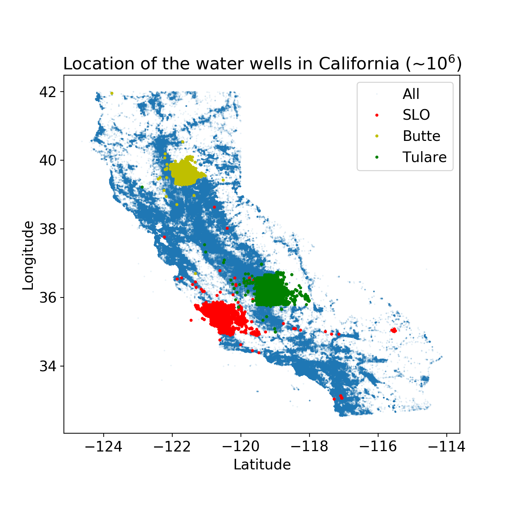

.. well-n-calm documentation master file, created by
   sphinx-quickstart on Thu Mar  7 22:54:51 2019.
   You can adapt this file completely to your liking, but it should at least
   contain the root `toctree` directive.

well-n-calm
===========

The well-n-calm is a resource to guide archiving various well data related to groundwater problems in California.
Currently, it is focused to provide a consistent format to organize compiled well data
in Envrionmental Geophysics group at Stanford. We share our lessons learned to compile well data
in our group for past 5 years while solving groundwater problems in California.
List of major projects incuding well data are:

- Butte
- Kaweah (Tulare)
- Indian Wells Valley
- San Louis Obispo

With the organization of well data in these projects, we also develop a basic python code base such that
one can easily explore the existing data sets, import new data, and export the data sets to various formats (e.g. LAS, CSV).

    Location of the water wells in California. Around milllon wells are plotted.

Contents:
^^^^^^^^^

.. toctree::
   :maxdepth: 1

   content/data_sources.rst
   content/data_format.rst
   content/data_types.rst
   content/data_explorer.rst

Feedback:
^^^^^^^^^

Have comments or suggestions? Submit feedback here_.

.. _here: XXX.

Contributors:
^^^^^^^^^^^^^

.. include:: authors.rst
